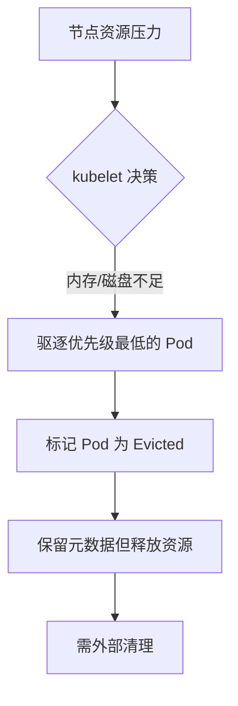
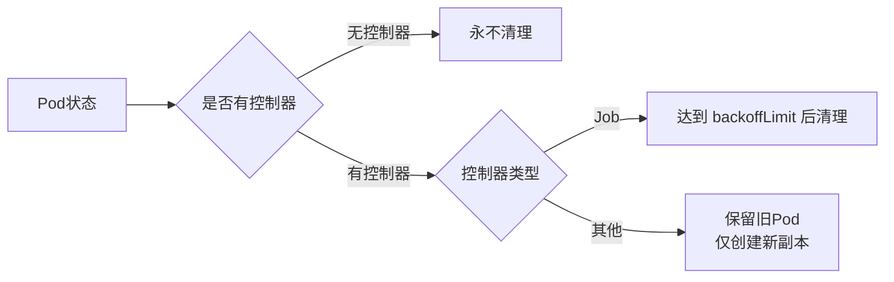

以下是关于 Kubernetes 中 `Evicted`、`Failed`、`CrashLoopBackOff` 和 `Error` 四种 Pod 状态的详细对比说明：

---

### 一、状态区别与触发原因
| **状态**             | **触发原因**                                     | **典型场景**                                |
| -------------------- | ------------------------------------------------ | ------------------------------------------- |
| **Evicted**          | 节点资源不足（内存/磁盘压力）                    | 节点 OOM、磁盘空间不足、超过资源配额        |
| **Failed**           | Pod 内所有容器终止，且至少一个容器以非零状态退出 | 容器执行失败、应用崩溃、启动命令错误        |
| **CrashLoopBackOff** | 容器反复崩溃，Kubernetes 在重启之间增加延迟      | 应用持续崩溃、配置错误、依赖服务不可用      |
| **Error**            | 容器无法启动（镜像问题/配置错误）                | 镜像拉取失败、启动命令错误、Volume 挂载失败 |

---

### 二、Kubernetes 处理逻辑对比
| **状态**             | **Kubernetes 行为**                                          | **是否尝试恢复** |
| -------------------- | ------------------------------------------------------------ | ---------------- |
| **Evicted**          | - 立即终止 Pod<br>- 不会重新调度<br>- 保留元数据用于诊断     | ❌ 不会自动恢复   |
| **Failed**           | - 根据 `restartPolicy` 决定行为<br>- `Never`：保持状态<br>- `OnFailure`：重启容器 | ✅ 按策略可能重启 |
| **CrashLoopBackOff** | - 指数退避重启（延迟：10s→20s→40s...上限 5min）<br>- 持续监控容器状态 | ✅ 持续尝试恢复   |
| **Error**            | - 记录错误事件<br>- 根据策略决定是否重启<br>- 不会退避延迟   | ✅ 立即尝试重启   |

> **重启策略说明** (`spec.restartPolicy`)：
> - `Always`：总是重启（默认）
> - `OnFailure`：非零退出时重启
> - `Never`：不重启

---

### 三、自动清理机制对比
| **状态**             | **是否自动清理** | **清理条件**                                                 |
| -------------------- | ---------------- | ------------------------------------------------------------ |
| **Evicted**          | ❌ 默认不清理     | 需手动或通过外部机制清理                                     |
| **Failed**           | ⚠️ 有条件清理     | - Job：达到 `backoffLimit` 后清理<br>- 其他控制器：通常保留旧 Pod |
| **CrashLoopBackOff** | ❌ 不会自动清理   | 持续尝试恢复，需手动干预或设置自动清理                       |
| **Error**            | ❌ 不会自动清理   | 通常保留用于诊断                                             |

---

### 四、关键机制详解
#### 1. Evicted 处理流程


#### 2. CrashLoopBackOff 退避算法

```python
# 伪代码：指数退避重启
delay = 10  # 初始延迟（秒）
max_delay = 300  # 最大延迟（5分钟）

while pod_in_crashloop:
    if container_crashed:
        wait(delay)
        restart_container()
        delay = min(delay * 2, max_delay)  # 指数退避
    else:
        delay = 10  # 重置延迟
```

#### 3. 控制器差异处理
- **Deployment/ReplicaSet**  
  创建新 Pod 替换故障 Pod，但保留旧 Pod（需设置 `revisionHistoryLimit` 清理）
- **Job**  
  `spec.backoffLimit` 控制重试次数，超过后标记 Job 失败并清理 Pod
- **裸 Pod（无控制器）**  
  永不自动清理

---

### 五、最佳实践建议
1. **Evicted**  
   - 设置节点自动缩放（Cluster Autoscaler）
   - 定期清理脚本（每日执行）

 ```bash
   kubectl get pods -A -o jsonpath='{range .items[?(@.status.reason=="Evicted")]}{.metadata.name}{"\n"}{end}' | xargs -I{} kubectl delete pod {} --ignore-not-found
```

2. **CrashLoopBackOff**  
   - 诊断命令：
```bash
   kubectl describe pod <pod-name> | grep -A 10 "Events:"
   kubectl logs <pod-name> --previous  # 查看上次崩溃日志
```

3. **Failed/Error**  
   - 检查容器退出码：
```bash
   kubectl get pod <pod-name> -o jsonpath='{.status.containerStatuses[].state.terminated.exitCode}'
```
   - 常见退出码：
     - `0`：成功退出
     - `1`：应用错误
     - `137`：OOM 杀死
     - `143`：优雅终止

4. **全局自动清理方案**  
   使用 `ttlSecondsAfterFinished` (仅限 Job) 或第三方控制器：
```yaml
   apiVersion: batch/v1
   kind: Job
   metadata:
     name: cleanup-job
   spec:
     ttlSecondsAfterFinished: 3600  # 1小时后自动删除
     template:
       spec:
         containers: [...]
```

---

### 六、核心结论
1. **状态本质区别**：  
   - `Evicted` = 资源不足强制驱逐  
   - `Failed` = 容器执行失败终止  
   - `CrashLoopBackOff` = 崩溃循环恢复中  
   - `Error` = 启动阶段致命错误

2. **K8s 自动清理规则**：  


3. **生产环境建议**：  
   - 为所有工作负载配置控制器（Deployment/StatefulSet/Job）
   - 设置资源请求/限制防止 Evicted
   - 实现自动化清理流水线（如 CronJob + 清理脚本）
   - 监控关键事件：`kubectl get events --field-selector type=Warning`

> 通过理解这些状态背后的机制，您可以更有效地诊断集群问题并优化资源管理策略。